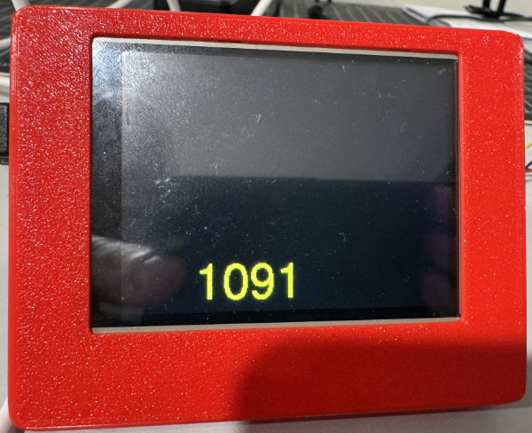
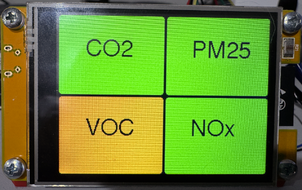
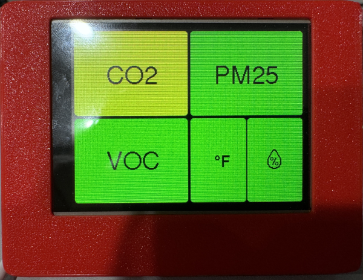
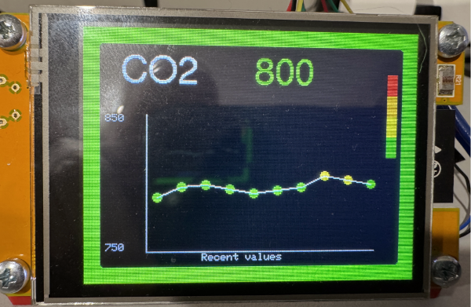
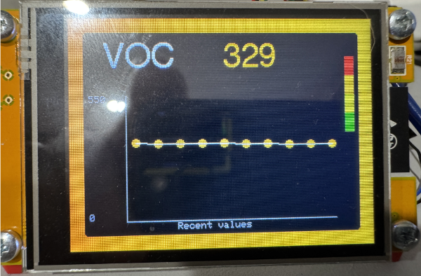
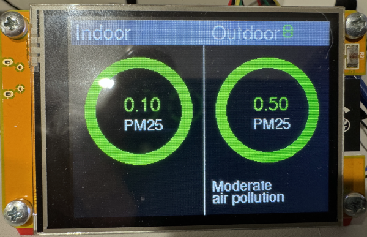
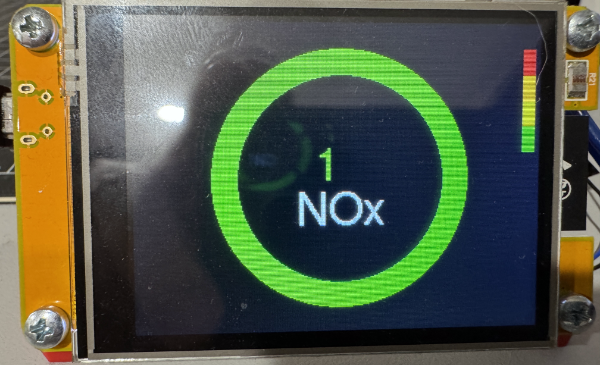
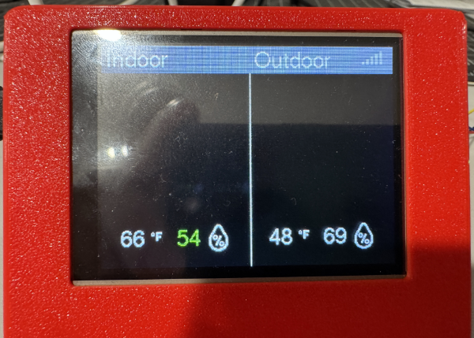

# Powered Air Quality
AI: Add hero show with new enclosure :)
## Purpose
Powered Air Quality, aka PAQ, samples, displays, and if connected to WiFi, logs the following air characteristics:
- Temperature (fahrenheit)
- Humidity
- CO2 (carbon dioxide)
- PM2.5 (air particulate)
- VOC (volatile organic compounds) index
- NOx (nitrogen oxide) index (requires SEN6x sensor)

If PAQ is connected to WiFi, it can log this information to a number of network endpoints.

PAQ was created to answer three primary questions:
- Is the co2 level in the room good?
- What is the particulate count in the air outside, and how much of that got into the room? This is particularly relevant during fire season.
- When we use the gas stove or the central heater, how does it change our indoor air quality?

## Associated projects
PAQ has a number of sibling projects that share many common hardware and code attributes. Those are:
- [Air Quality](https://github.com/ericklein/air_quality) has the same functionality as PAQ minus air particulate measurement. It is powered by a battery
- [RCO2](https://github.com/ericklein/rco2) is a small, portable version of Air Quality that only samples and displays air quality levels.
- [Badge](https://github.com/ericklein/badge) is RCO2 in a badge form factor capable of displaying additional information beyond air quality levels.
## Features
NOTE: All screens are engineering art, not final design :)

PAQ exposes air characteristics through a number of screens. When the device is idle, it displays the CO2 ppm level as moving text to protect the screen (eg. screensaver mode)

If the screen is touched while in screensaver mode, it will display the main menu. Touching any of the options takes the user to the corresponding component information screen.

The main menu varies if the device is configured with a SEN66, which can detect NOx levels

or with the combination of an SCD40 and SEN54, which can not detech NOx levels.

If CO2 is selected from the main menu, it will display a screen highlighting the current CO2 level in ppm and US standard color code level, plus a graph of most recent values. Tapping anywhere on the screen will return to the main menu.

If VOC is selected from the main menu, it will display a screen highlighting the current VOC level in ppm and US standard color code level, plus a graph of most recent values. Tapping anywhere on the screen will return to the main menu.

If PM25 is selected from the main menu, it will display a screen highlighting the current indoor and outdoor PM25 level in ppm and US standard color code level, plus the current outdoor US AQI level. It will also display a red or green database icon if the device is succeeding at logging data to network endpoints. Tapping anywhere on the screen will return to the main menu.

If NOx is selected from the main menu, it will display a screen highlighting the current NOx level in ppm and US standard color code level. Tapping anywhere on the screen will return to the main menu.

If temp/humidity is selected from the main menu, it will display a screen highlighting the current indoor and outdoor temperature in Fahrenheit and humdidity. It will also display the current WiFi connectivity level in the upper right of the screen. Tapping anywhere on the screen will return to the main menu.

## Target configuration
- Set parameter configuration using config.h
- Private configuration settings including network endpoint credentials are contained in a `secrets.h` file that is not included in this repo.  Instead you'll find the file `secrets_template.h`, which should be copied to `secrets.h` and then edited to supply the right access credentials and configuration values to match your deployment environment.
- Copy the contents of the "put in TFT_eSPI folder" into the "TFT_eSPI" folder found the Arduino library folder.
- If the device can not connect to a WiFi access point, it will bring up a screen directing you to configure the device via a browser portal window. Entering the configuration data in this portal will then reboot the device and connect to the entered WiFi AP.
## Bill of Materials (BOM)
### MCU
- [CYD (Cheap Yellow Display)])(https://github.com/witnessmenow/ESP32-Cheap-Yellow-Display/tree/main). This is an inexpensive ESP32 prototype board with a built-in screen.
    - Arduino IDE should be told to target the "ESP32 Dev Module" board, which you can find once you install the ESP32 BSP
    - Code is portable to any ESP32 MCU
### WiFi
- [CYD (Cheap Yellow Display)])(https://github.com/witnessmenow/ESP32-Cheap-Yellow-Display/tree/main). This is an inexpensive ESP32 prototype board with a built-in screen.
    - Code is portable to any ESP32 MCU
### Sensors
Two sensor payloads are supported by PAQ
- Option 1
    - [Sensirion SCD40](readme/Sensirion_CO2_Sensors_SCD4x_Datasheet.pdf), measuring temperature, humidity, and CO2
    and
    - [Sensirion SEN54](readme/Sensirion_Datasheet_Environmental_Node_SEN5x.pdf), measuring pm1, pm25, pm4, pm10, humidity, temperature, and VOC index 
- Option 2
    - [Sensirion SEN66](readme/Sensirion_Datasheet_SEN6x.pdf), measuring pm1, pm25, pm4, pm10, humidity, temperature, VOC index, and NOx index

Support for the [Plantower PMSA003I](https://www.adafruit.com/product/4632), which has a subset of the SEN5x functionality, was deprecated by can be found in older code versions.
### Screen
- [CYD (Cheap Yellow Display)])(https://github.com/witnessmenow/ESP32-Cheap-Yellow-Display/tree/main). This is an inexpensive ESP32 prototype board with a built-in screen.
    - any CYD screen using a ILI9341 driver is supported, ST7789 based screens are not supported
### Buttons/Switches
- Touchscreen support is used for user input.
## Pinouts
### SCD40
- Connected through Stemma QT cable to SEN5X adapter board
### SEN54
- Connected to CYD through a custom cable and SEN54 to [Adafruit SEN5x to i2c adapter board](https://www.adafruit.com/product/5964)
#### Custom cable from CYD to SEN5X adapter board
- CYD connector is [JST 1.25mm pitch 4 pin](https://www.amazon.com/dp/B0DFCHWTXK?ref=fed_asin_title&th=1)
- Adafruit connector is JST SH 1.0mm pitch 4 pin
    - I cut the male breadboard ends off this [Adafruit cable](https://www.adafruit.com/product/4209) to get the appropriate second part of the cable
- This custom cable attaches to CYD connector CN1
    - GND to GND
    - GPIO 22 to SDA (often Blue) pin
    - GPIO 27 to SCL (often Yellow) pin
    - 3.3v to 3.3v
## Supported network endpoints
### MQTT
- uncomment #define MQTT in config.h
- set appropriate parameters in config.h and secrets.h
    - Technical References
        - https://hackaday.com/2017/10/31/review-iot-data-logging-services-with-mqtt/
### Hassio MQTT
- AI: ADD DOCUMENTATION
### InfluxDB
- AI: ADD DOCUMENTATION
## Software Dependencies
- ArduinoJson by Benoit Blanchon
- Adafruit ILI9341 (and dependencies)
- Sensirion I2C SEN5X (and dependencies)
- Sensirion I2C SCD4x (and dependencies)
- ESP8266 Influxdb by Tobias Schurg (which also works for ESP32 despite the name)
## Issues and Feature Requests
- [Github Issues](https://github.com/ericklein/powered_air_quality/issues)
## .plan (big ticket items)
- [WiFI Manager](https://github.com/tzapu/WiFiManager) support
- OTA firmware update support
- button support to cycle through multiple information screens
## Supporting Material
### Screen
- https://cdn-learn.adafruit.com/downloads/pdf/adafruit-gfx-graphics-library.pdf
### Temperature and Humdity
- [Ideal indoor humidity](https://iaq.works/humidity/indoor-humidity-level-why-is-the-40-60-range-ideal/)
### CO2 (Carbon Dioxide)
#### Scales
We currently use the following scale, which is modifiable in config.h:
- <800 - Good
- 800-999 - So-So
- 1000+ - Poor
##### Alternate ideas
- 
- 
- 
- US NIOSH (1987) recommendations:
    - 250-350 ppm - normal outdoor ambient concentrations
    - 600 ppm - minimal air quality complaints
    - 600-1,000 ppm - less clearly interpreted
    - 1,000 ppm - indicates inadequate ventilation; complaints such as headaches, fatigue, and eye and throat irritation will be more widespread; 1,000 ppm should be used as an upper limit for indoor levels
#### Impact on health
- [CO2 and indoor air quality](readme/CO2_and_indoor_air_quality.pdf)
#### Sensors
- [CO2 sensor types](https://www.airgradient.com/blog/co2-sensors-photo-acoustic-vs-ndir-updated/)
- SCD40 sensor
    - [SCD40 datasheet](readme/Sensirion_CO2_Sensors_SCD4x_Datasheet.pdf)
### AQI
- [AQI Overview](readme/aqi_overview.md)
- https://en.wikipedia.org/wiki/Air_quality_index#CAQI
- [Open Weather Map Air Pollution API](https://openweathermap.org/api/air-pollution)
- [OSHA Air Quality](readme/OSHA_Indoor_Air_Quality.pdf)
- [Great site for air quality info](https://itsairborne.com/)
- [NYT on indoor gas stoves](https://www.nytimes.com/2023/01/29/climate/gas-stove-health.html)
#### Scales
We currently use the following scale, which is modifiable in config.h:

- 0-25 : "Good" : Green
- 26-50 : "Fair" : Yellow
- 51-150 : "Poor" : Orange
- 151+ : "Bad" : Red

Options:
- Open Weather Map scale

- Aware scale

- Australian local goverment scale

- government standard scale

### VOC (Volatile Organic Compounds)
[Sensirion documentation on VOC](readme/Info_Note_VOC_Index.pdf)
#### Scale
We currently use the following scale, which is modifiable in config.h:

- 0-150 : "Good" : Green
- 151-250 : "Fair" : Yellow
- 251-400 : "Poor" : Orange
- 401+ : "Bad" : Red