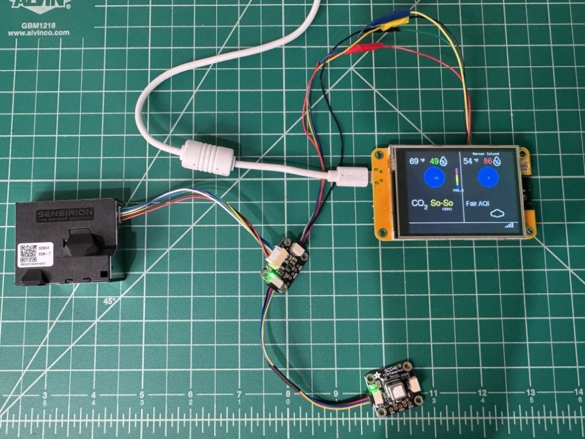
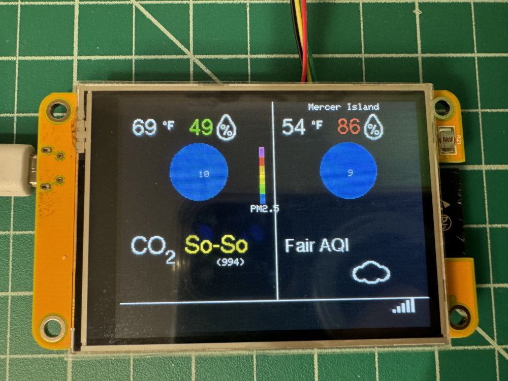
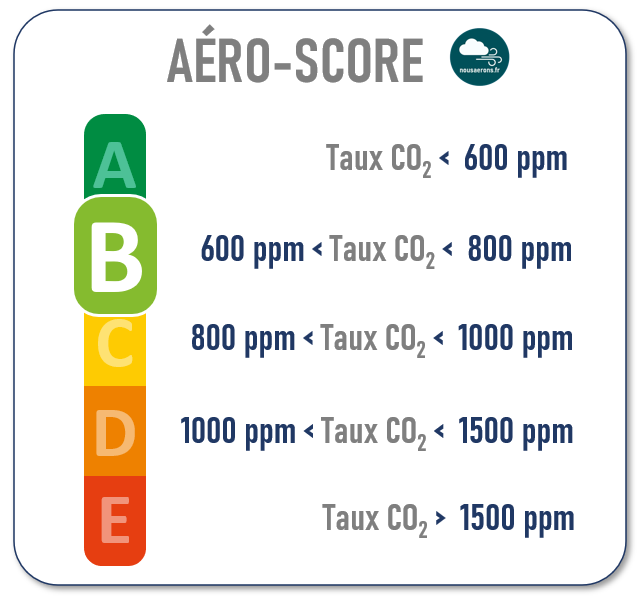
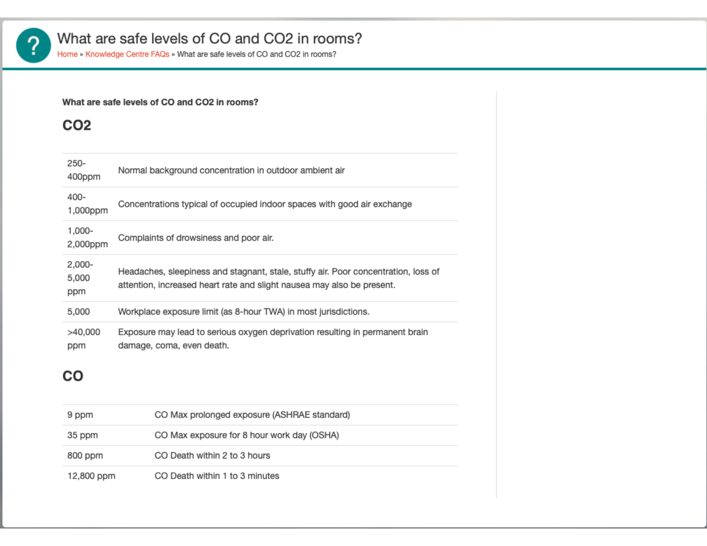
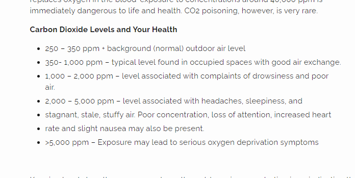
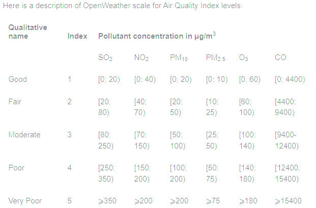
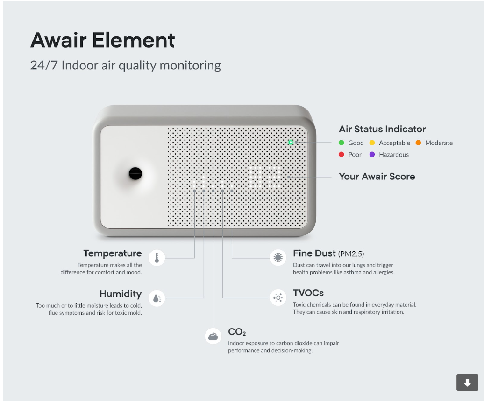
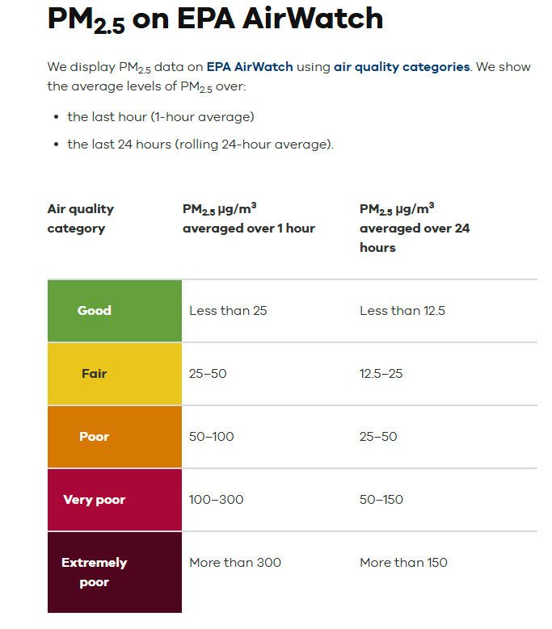
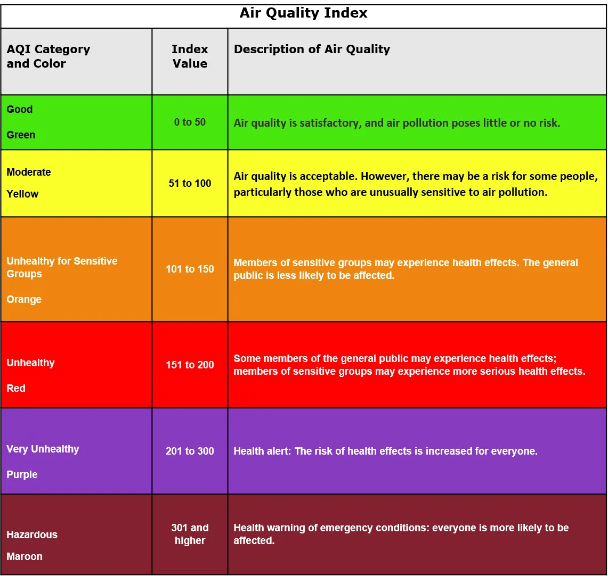

# Powered Air Quality

## Purpose
Powered Air Quality, aka PAQ, samples and displays temperature, humidity, CO2 (carbon dioxide), and air particulate levels. If PAQ is connected to WiFi, it can log this information to a number of network endpoints, and it displays local outdoor weather and air quality information to compliment the indoor sensor information. PAQ requires an AC power source.

PAQ was created to answer three primary questions:
- Is the co2 level in the room good?
- What is the particulate count in the air outside, and how much of that got into the room? This is particularly relevant during fire season.
- When we use the gas stove or the central heater, how does it change our indoor air quality?

## Associated projects
PAQ has a number of sibling projects that share many common hardware and code attributes. Those are:
- [Air Quality](https://github.com/ericklein/air_quality) has the same functionality as PAQ minus air particulate measurement. It is powered by a battery
- [RCO2](https://github.com/ericklein/rco2) is a small, portable version of Air Quality that only samples and displays air quality levels.
- [Badge](https://github.com/ericklein/badge) is RCO2 in a badge form factor capable of displaying additional information beyond air quality levels.
## Features

AI : ADD DOCUMENTATION
## Target configuration
- Set parameter configuration using config.h
- Private configuration settings including WiFi SSID/password and network endpoint credentials are contained in a `secrets.h` file that is not included in this repo.  Instead you'll find the file `secrets_template.h`, which should be copied to `secrets.h` and then edited to supply the right access credentials and configuration values to match your deployment environment.
## Bill of Materials (BOM)
### MCU
- [CYD (Cheap Yellow Display)])(https://github.com/witnessmenow/ESP32-Cheap-Yellow-Display/tree/main). This is an inexpensive ESP32 prototype board with a built-in screen.
    - Code is portable to any ESP32 MCU
### WiFi
- [CYD (Cheap Yellow Display)])(https://github.com/witnessmenow/ESP32-Cheap-Yellow-Display/tree/main). This is an inexpensive ESP32 prototype board with a built-in screen.
    - Code is portable to any ESP32 MCU
### Sensors
- [SCD40 temp/humidity/CO2 sensor](https://www.adafruit.com/product/5187)
    can use any SCD40 connected over i2c
- Particulate sensor over i2c
    - [Sensirion SEN54]([SEN54](readme/Sensirion_Datasheet_Environmental_Node_SEN5x.pdf))
    - [Plantower PMSA003I](https://www.adafruit.com/product/4632)
        - this sensor does not provide as much particulate information as the SEN54. Code support is still included but is commented out in the current release.
### Screen
- [CYD (Cheap Yellow Display)])(https://github.com/witnessmenow/ESP32-Cheap-Yellow-Display/tree/main). This is an inexpensive ESP32 prototype board with a built-in screen.
    - any screen with ILI9341 driver
### Buttons/Switches
- None at this time.
## Pinouts
### SCD40
- Connected through Stemma QT cable to SEN5X adapter board
### SEN54
- Connected to CYD through a custom cable and SEN54 to [Adafruit SEN5x to i2c adapter board](https://www.adafruit.com/product/5964)
#### Custom cable from CYD to SEN5X adapter board
- CYD connector is [JST 1.25mm pitch 4 pin](https://www.amazon.com/dp/B0DFCHWTXK?ref=fed_asin_title&th=1)
- Adafruit connector is JST SH 1.0mm pitch 4 pin
    - I cut the male breadboard ends off this [Adafruit cable](https://www.adafruit.com/product/4209) to get the appropriate second part of the cable
- This custom cable attaches to CYD connector CN1
    - GND to GND
    - GPIO 22 to SDA (often Blue) pin
    - GPIO 27 to SCL (often Yellow) pin
    - 3.3v to 3.3v
## Supported network endpoints
### MQTT
- uncomment #define MQTT in config.h
- set appropriate parameters in config.h and secrets.h
    - Technical References
        - https://hackaday.com/2017/10/31/review-iot-data-logging-services-with-mqtt/
### Hassio MQTT
- AI: ADD DOCUMENTATION
### InfluxDB
- AI: ADD DOCUMENTATION
## Issues and Feature Requests
- [Github Issues](https://github.com/ericklein/powered_air_quality/issues)
## .plan (big ticket items)
- [WiFI Manager](https://github.com/tzapu/WiFiManager) support
- OTA firmware update support
- button support to cycle through multiple information screens
## Supporting Material
### Screen
- https://cdn-learn.adafruit.com/downloads/pdf/adafruit-gfx-graphics-library.pdf
### Temperature and Humdity
- [Ideal indoor humidity](https://iaq.works/humidity/indoor-humidity-level-why-is-the-40-60-range-ideal/)
### CO2 (Carbon Dioxide)
#### Scales
We currently use the following scale:
- <800 - Good
- 800-999 - So-So
- 1000+ - Poor
##### Alternate ideas
- 
- 
- 
- US NIOSH (1987) recommendations:
    - 250-350 ppm - normal outdoor ambient concentrations
    - 600 ppm - minimal air quality complaints
    - 600-1,000 ppm - less clearly interpreted
    - 1,000 ppm - indicates inadequate ventilation; complaints such as headaches, fatigue, and eye and throat irritation will be more widespread; 1,000 ppm should be used as an upper limit for indoor levels
#### Impact on health
- [CO2 and indoor air quality](readme/CO2_and_indoor_air_quality.pdf)
#### Sensors
- [CO2 sensor types](https://www.airgradient.com/blog/co2-sensors-photo-acoustic-vs-ndir-updated/)
- SCD40 sensor
    - [SCD40 datasheet](readme/Sensirion_CO2_Sensors_SCD4x_Datasheet.pdf)
### AQI
- [AQI Overview](readme/aqi_overview.md)
- https://en.wikipedia.org/wiki/Air_quality_index#CAQI
- [Open Weather Map Air Pollution API](https://openweathermap.org/api/air-pollution)
- [OSHA Air Quality](readme/OSHA_Indoor_Air_Quality.pdf)
- [Great site for air quality info](https://itsairborne.com/)
- [NYT on indoor gas stoves](https://www.nytimes.com/2023/01/29/climate/gas-stove-health.html)
#### Scales
We currently use the following scale:

- 0-25 : "Good" : Green
- 26-50 : "Fair" : Yellow
- 51-150 : "Poor" : Orange
- 151+ : "Bad" : Red

Options:
- Open Weather Map scale

- Aware scale

- Australian local goverment scale

- government standard scale
